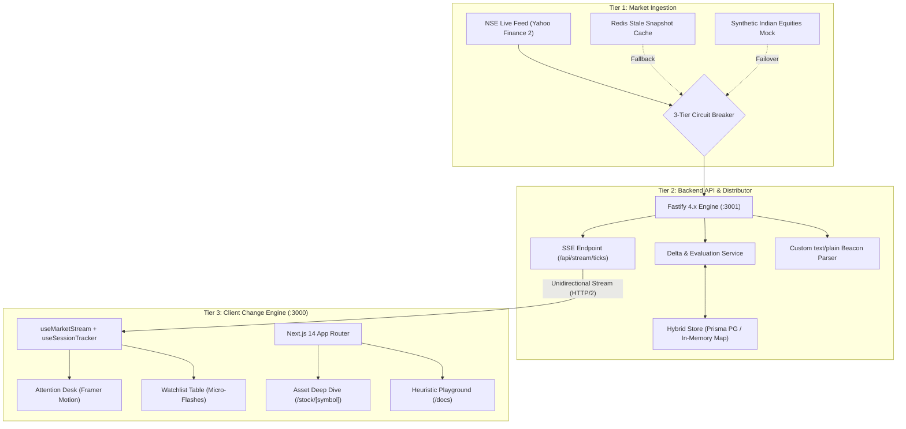

# 📋 Product Requirements Document (PRD) - PulseMark

**Product Name:** PulseMark  
**Tagline:** Smart Market Watchlist & Event-Driven Temporal Change Engine  
**Repository:** [https://github.com/Khushi1310-nayak/PulseMark.git](https://github.com/Khushi1310-nayak/PulseMark.git)  
**Version:** 1.0.0 (Production-Ready)  
**Target Markets:** Indian Equities (NSE), Quantitative Traders, Active Market Participants  

---

## 1. Executive Summary & 100-Word Pitch

> Standard stock watchlists act as dumb tabular spreadsheets: dumping raw green/red daily numbers that force traders to mentally remember where an equity stood hours or days ago. **PulseMark** replaces visual scanning with an **Event-Driven Change Engine**. When a user returns after minutes, hours, or days, PulseMark computes multi-dimensional deltas against the exact snapshot of their prior session ($T_0$), scores anomalies across price trajectory, volume compression/spikes, range breaches, and VWAP deviation, and instantly groups items into an actionable **Attention Desk** vs. normal trading.

PulseMark transforms static watchlist monitoring into an intelligent, proactive surveillance terminal. It eliminates cognitive fatigue by surfacing only meaningful changes that occurred during the user's absence, powered by real-time Server-Sent Events (SSE), a 3-tier circuit breaker, and a pure functional quantitative scoring engine.

---

## 2. Problem Statement & User Pain Points

### Inherent Flaws of Traditional Stock Watchlists

1. **Naive Daily Percentage Change:**  
   Traditional tools display $\Delta P = \frac{P_{\text{current}} - P_{\text{prev\_close}}}{P_{\text{prev\_close}}}$. If a stock opened $+3\%$ at 9:15 AM and drifts sideways all day, it shows $+3\%$ green, masking the reality that nothing has happened for 4 hours. Conversely, if a stock was flat all morning and suddenly drops $-2\%$ in 10 minutes, the daily change shows only $-1\%$, failing to highlight the sudden flash move.

2. **The "Cognitive Memory Tax":**  
   Traders must constantly remember: *"Where was Tata Motors when I stepped away for lunch?"* or *"Did Reliance cross its morning resistance while I was in a meeting?"* Human memory degrades across session intervals, leading to missed trades or delayed risk management.

3. **Alert Fatigue & Noise Overload:**  
   Simple price threshold alerts either trigger incessantly on minor noise or fail to trigger when volume explodes without immediate price movement (a classic institutional accumulation pattern).

4. **No Separation of Urgent vs. Normal Market Action:**  
   Traders are forced to visually scan 30–50 rows of identical-looking ticker tables to discover which asset actually demands immediate intervention.

---

## 3. Goals & Success Criteria

### Primary Product Goals

- **Zero Mental Tracking:** Quantify market change relative to the user's last logout/departure timestamp ($T_0$), not an arbitrary midnight clock.
- **Instant Attention Surfacing:** Surface equities exhibiting anomalous behavior into an elevated "Attention Desk" with plain-English rationales.
- **Low-Latency Streaming:** Distribute real-time price updates with sub-millisecond local evaluation and under 50ms server-to-client propagation.
- **Fail-Safe Operation:** Never crash or display blank screens during external API outages, rate limits, or network dropouts.
- **Zero-Friction Evaluation:** Boot with zero external database or caching requirements (in-memory Map fallback) while supporting production PostgreSQL and Redis clustering.

---

## 4. User Personas

| Persona | Description | Key Need | PulseMark Solution |
| :--- | :--- | :--- | :--- |
| **Active Day Trader** | Monitors 10–20 high-beta Indian equities (Nifty 50) throughout market hours. | Needs immediate awareness of sudden intraday volume surges or VWAP breaks. | Attention Desk ranks anomalies with live price flashes and clear trigger chips. |
| **Session Returner** | Steps away from terminal for meetings, lunch, or client calls (15m to 4h). | Wants to know exactly what moved and why while they were away. | Session Tracker commits $T_0$ snapshot; on return, computes multi-factor delta against $T_0$. |
| **Swing Investor** | Checks terminal once or twice a day or across multi-day weekends. | Needs macro delta tracking across daily session boundaries without clutter. | Time Travel & Session Baseline diffing maintains historical benchmark anchors. |
| **Quantitative Evaluator** | Reviews system heuristics, architecture, and resilience under extreme market stress. | Needs interactive parameter tuning and chaos injection to verify edge cases. | `/docs` Heuristic Playground & Evaluator Chaos Drawer (`?demo=evaluator`). |

---

## 5. Core Concepts & Mathematical Formulation

### 5.1 Temporal Session Baseline ($T_0$)

When a user logs in, PulseMark identifies their previous session snapshot ($T_0$). If no prior session exists (or upon manual reset), $T_0$ defaults to the stock's market opening price and initial volume. When the user leaves, hides the browser tab, or logs out, `navigator.sendBeacon` automatically records an atomic exit snapshot containing:

- Baseline Price ($P_{T_0}$)
- Cumulative Volume ($V_{T_0}$)
- Benchmark Intraday VWAP ($\text{VWAP}_{T_0}$)
- Day High / Low extremes at departure

### 5.2 Multi-Factor Anomaly Scoring Algorithm

Every incoming market tick is evaluated through a deterministic scoring function across four orthogonal dimensions:

$$\text{Composite Score} = \min\left(100, S_{\text{price}} + S_{\text{volume}} + S_{\text{range}} + S_{\text{vwap}}\right)$$

#### Factor 1: Price Delta vs. Session Baseline ($S_{\text{price}}$, Max 45 pts)

$$\Delta P_{\%} = \left|\frac{P_{\text{current}} - P_{T_0}}{P_{T_0}}\right| \times 100$$

- $\Delta P_{\%} \ge 3.0\% \implies 45\text{ pts}$ (Critical flash movement)
- $\Delta P_{\%} \ge 1.5\% \implies 30\text{ pts}$ (Substantial shift)
- $\Delta P_{\%} \ge 0.8\% \implies 15\text{ pts}$ (Moderate drift)
- $\Delta P_{\%} < 0.8\% \implies 0\text{ pts}$

#### Factor 2: Volume Surge vs. 30-Day Trailing Baseline ($S_{\text{volume}}$, Max 30 pts)

$$\text{Ratio}_{\text{vol}} = \frac{V_{\text{current}}}{\bar{V}_{30\text{d}} / 6.25\text{ hours}}$$

- $\text{Ratio}_{\text{vol}} \ge 3.0\times \implies 30\text{ pts}$ (Aggressive institutional presence)
- $\text{Ratio}_{\text{vol}} \ge 2.0\times \implies 20\text{ pts}$ (Elevated trading activity)
- $\text{Ratio}_{\text{vol}} \ge 1.5\times \implies 10\text{ pts}$ (Above-average participation)

#### Factor 3: Intraday Session Range Breach ($S_{\text{range}}$, Max 15 pts)

- High Breakout: $P_{\text{current}} > \text{DayHigh}_{T_0} \implies 15\text{ pts}$ (Resistance pierced)
- Low Breakdown: $P_{\text{current}} < \text{DayLow}_{T_0} \implies 15\text{ pts}$ (Support breached)

#### Factor 4: VWAP Divergence ($S_{\text{vwap}}$, Max 10 pts)

$$\text{Div}_{\text{vwap}} = \left|\frac{P_{\text{current}} - \text{VWAP}}{\text{VWAP}}\right| \times 100$$

- $\text{Div}_{\text{vwap}} \ge 1.5\% \implies 10\text{ pts}$ (Intraday price unanchored from mean)

#### Decision Rule

An equity is automatically elevated to the **Attention Desk** if:

$$\text{Composite Anomaly Score} \ge 35$$

---

## 6. System Architecture & Component Breakdown

PulseMark is architected as an event-driven monorepo with clean separation between shared mathematical contracts, a high-throughput Fastify ingestion distributor, and a dynamic Next.js 14 presentation layer:

---

## 7. What Was Built (Comprehensive Implementation Inventory)

### 7.1 Shared Core Engine (`@pulsemark/shared`)

- **Type-Safe Domain Contracts:** `StockTick`, `SessionSnapshot`, `MeaningfulChange`, `SensitivityConfig`, `StockHistoricalCandle`, `AuditLogEntry`.
- **Pure Functional Evaluator:** Fully deterministic `evaluateStockAnomaly()` function that executes without DOM or Node dependencies, ensuring identical scoring on client and server.
- **Sensitivity Thresholds:** Configurable thresholds supporting User, Aggressive, Moderate, and Conservative profiles.

### 7.2 High-Throughput API (`@pulsemark/api`)

- **Fastify 4.x Server:** Low-overhead Node.js server binding to `0.0.0.0:3001` with optimized JSON serialization and CORS headers.
- **3-Tier Feed Ingestion Service:**
  1. *Primary:* Yahoo Finance real-time quote batching for Indian NSE equities (`TATAMOTORS`, `INFY`, `TCS`, `RELIANCE`, etc.).
  2. *Secondary:* Redis stale cache failover with `isStale: true` indicators and automatic reconnect loops.
  3. *Tertiary:* Synthetic market simulation with Brownian noise for offline testing and evaluation.
- **Server-Sent Events (SSE) Streaming:** `/api/stream/ticks` emitting unified initial snapshots and real-time delta broadcasts with `X-Accel-Buffering: no` to eliminate proxy buffering lag.
- **Tab-Close Beacon Parser:** Custom Fastify parser for `text/plain` payloads ensuring `navigator.sendBeacon` reliably records $T_0$ snapshots upon browser exit.
- **Zero-Config Database Fallback:** Automatic detection of `DATABASE_URL` and `REDIS_URL`. Defaults to high-speed in-memory Maps with zero setup required.
- **Historical Candlestick Engine:** Fetches 5-minute intraday chart bars from Yahoo Finance with fallback to structured synthetic candles.

### 7.3 Client Change Engine (`@pulsemark/web`)

- **Next.js 14 App Router:** Server-side rendered shell with responsive client-side terminal grid and dark glassmorphic styling (`#070A0F`).
- **Attention Desk:** Dynamic top deck displaying critical anomaly cards with color-coded severity badges, trigger rationale pills, and price delta statistics.
- **High-Density Watchlist Matrix:**
  - Micro-flashing on tick fluctuations (Emerald `#10B981` on uptick, Rose `#F43F5E` on downtick).
  - SVG sparklines, 52-week range bars, volume surge multipliers, and search/filter inputs.
  - Tabbed switching across multiple watchlists (Tech, Banking, Auto) with creation/deletion drawers.
- **Stock Deep-Dive Page (`/stock/[symbol]`):**
  - Side-by-side comparison matrix: Session Baseline ($T_0$) vs. Live Market ($T_{\text{now}}$).
  - 40-candle interactive intraday SVG timeline with clickable nodes to inspect historical trigger points.
  - Fortified with `safeHistory` fallbacks to eliminate `Infinity`/`NaN` rendering bugs.
  - Comprehensive threshold audit log tracking all past alerts for that symbol.
- **Interactive Documentation (`/docs`):**
  - **Interactive Anomaly Heuristic Playground:** Real-time multi-factor simulator with live sliders and instant scenario presets (Institutional Squeeze, Flash Breakdown, Quiet Session).
  - **Architecture & Pipeline Visualizer:** Interactive 4-stage flow canvas with click-to-inspect modal detail cards.
  - **Architectural Decision Records (ADRs):** Comprehensive technical explanations (SSE vs. WebSockets, In-Memory vs. Database, Beacon vs. WebSocket Exit).
  - **Data Contracts & Formulas:** Full mathematical specification and JSON payloads.
- **Evaluator Chaos Studio (`?demo=evaluator`):**
  - Time travel simulation: Simulate returning to the terminal after 15m, 1h, 4h, 1d, 3d.
  - Volatility injection: Trigger artificial $\pm 4\%$ price spikes or $3.5\times$ volume surges.
  - Network chaos: Force simulated exchange disconnections to prove circuit-breaker behavior.
- **Session Liveness & Footer Telemetry:**
  - 30-second silent heartbeat loop to keep session benchmarks active.
  - Live round-trip network ping display (e.g., `Latency: 24ms`) with feed source indicators.

---

## 8. Non-Functional & Production Requirements

1. **Latency & Performance:**
   - Evaluator execution latency: $< 1\text{ms}$ per stock.
   - SSE client broadcast: Every $2.5\text{ seconds}$ with sub-25ms round-trip delivery.
2. **Reliability & Fault Tolerance:**
   - 100% uptime through 3-tier circuit breaker: if Yahoo Finance rate-limits, server transparently serves cached or simulated data without throwing 500 errors.
   - Client automatically reconnects with exponential backoff on network disconnects.
3. **Memory Management:**
   - SSE connections cleanly unsubscribe listeners and clear keep-alive intervals on browser disconnect (`request.raw.on('close')`), preventing memory leaks.
4. **Environment Normalization:**
   - API endpoints and client hooks feature strict URL normalization (`.replace(/\/api\/?$/, '').replace(/\/+$/, '')`), eliminating trailing slash or double `/api/api` errors across reverse proxies.

---

## 9. Future Product Roadmap

- 📱 **Mobile Native Companion:** Flutter / React Native app with biometric lock and lock-screen widget showing Attention Desk count.
- 🔔 **WebPush & Telegram Alerts:** Serverless webhook triggers sending immediate push notifications when a Tier-1 anomaly triggers while offline.
- 📈 **Options & Derivative Greeks Delta:** Extend scoring to Implied Volatility (IV) crush and Open Interest (OI) buildup anomalies.
- 🏢 **Multi-Broker Integration:** Native OAuth connectivity to Zerodha Kite, Groww, and Upstox for automated bracket-order execution directly from the Attention Desk.

---

## 10. Document Sign-Off

- **Product Architect:** Manisa Nayak  
- **Status:** Approved & Implemented  
- **Deployment Status:** Zero Compile Errors, Verified Production Bundle  
